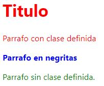
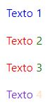
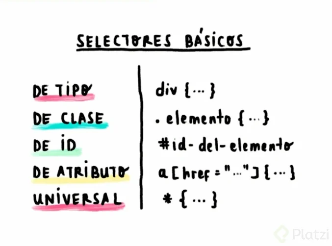

# **CURSO CSS**
## **1. Prerequisitos**
Si tomaste el curso de HTML en Academia X, estás listo para pasar directamente a la siguiente lección. Es un prerequisito tener conocimientos y experiencia con HTML. Si estudiaste HTML como autodidacta o vienes de otro servicio, lee los siguientes requisitos para no dejar brechas en tu conocimiento y tengas éxito en este curso:
Los desarrolladores utilizan un computador de escritorio con monitores grandes para realizar un trabajo más eficiente. Este curso lo puedes ver en dispositivos móviles pero tiene ejemplos que requieren trabajar con un monitor grande. Es un prerequisito tener un computador conectado al internet.
Una página web está compuesta de código escrito en archivos de HTML, CSS, JavaScript, y otros. Es un prerequisito que tengas experiencia previa visitando páginas web antes de iniciar este curso.
Estos archivos se abren con una aplicación que es tu navegador (los navegadores más populares son Chrome, Safari, Microsoft Edge, y Firefox). Es un prerequisito que tengas previa experiencia abriendo un navegador y utilizando sus funcionalidades básicas antes de iniciar este curso. 
El navegador es una aplicación que corre en tu sistema operativo (los más populares son Windows, MacOS, y Linux). Los dispositivos móviles como iPads y teléfonos inteligentes también tienen sistemas operativos (los más populares son Android y iOS). Es un prerequisito que tengas previa experiencia utilizando funcionalidades básicas de tu sistema operativo.
Los sistemas operativos trabajan con archivos y carpetas. Es un prerequisito que tengas previa experiencia creando, cambiando el nombre y la extensión, reorganizando, y borrando archivos y carpetas. 
Los archivos tienen extensiones que indican el tipo de contenido que contienen y la aplicación que los puede abrir. Por ejemplo: la extensión .txt es para archivos de texto simple, la extensión .doc es para archivos que se abren con la aplicación Word, los archivos con extensión .bmp son archivos de imágenes que se abren con la aplicación Paint. Es un prerequisito que tengas previa experiencia abriendo archivos de varias extensiones en sus aplicaciones.
Hay miles de aplicaciones que se pueden instalar en tu sistema operativo. A estas aplicaciones se les llama software. Puedes empezar instalando el navegador Chrome si no lo tienes. Es un prerequisito que tengas previa experiencia descargando instalando software en tu sistema operativo.
El internet está compuesto de servidores (que simplemente son computadoras sin monitores en muchas partes del mundo) que transmiten información (a través de cables bajo tierra y bajo el mar) hasta llegar a tu hogar cuando pides esta información. Eso quiere decir, que cuando visitas una página web lo que haces es simplemente pedir archivos que un desarrollador creó, subió a un servidor, y configuró una dirección. Este es un buen resumen, pero es un prerequisito que tengas un entendimiento básico de cómo funciona la web.
Los archivos de CSS son archivos de texto. Podrías editarlos con aplicaciones como Notepad en Windows o Notes en MacOS pero es recomendado utilizar un IDE que es una aplicación de edición de código más avanzado que le da colores a tu código para que sea más fácil de leer y tengas funciones de autocompletado. Algunas IDEs populares son Brackets, Atom, Sublime Text, Vim, y Visual Studio Code. Para este curso utilizaremos un IDE en línea.
## **2. PREGUNTAS FRECUENTES**
쯈ué es CSS y porqué debes aprenderlo?
CSS (Cascading Style Sheets) es un lenguaje de estilo utilizado para describir la apariencia y el formato de un documento escrito en HTML. Al utilizar CSS, puedes controlar la apariencia de varios elementos de HTML en un solo archivo de estilo, en lugar de tener que escribir el estilo para cada elemento individualmente. Esto hace que sea más fácil y rápido modificar la apariencia de un sitio web, y también hace que sea más fácil mantener y actualizar el sitio a lo largo del tiempo.

Es importante aprender CSS porque es uno de los pilares de la creación de sitios web. Aunque puedes crear un sitio web básico usando solo HTML, CSS te permite darle estilo y diseño a tu sitio, lo que lo hace más atractivo y fácil de usar para los visitantes. Además, muchos trabajos relacionados con la creación de sitios web requieren conocimientos de CSS, por lo que aprender CSS puede ser beneficioso para tu carrera profesional.

 

쮼n dónde se utiliza CSS?
CSS es utilizado en una amplia variedad de tecnologías y plataformas, incluyendo:

Sitios web: La mayoría de los sitios web modernos utilizan CSS para dar estilo y diseño a sus páginas.

Aplicaciones móviles: Muchas aplicaciones móviles utilizan CSS para controlar la apariencia de sus interfaces de usuario.

Aplicaciones de escritorio: Algunas aplicaciones de escritorio también pueden utilizar CSS para dar estilo a sus interfaces de usuario.

Presentaciones: Algunas herramientas de presentación, como Microsoft PowerPoint, permiten utilizar CSS para dar estilo a las diapositivas.

Correo electrónico: Algunos programas de correo electrónico, como Microsoft Outlook, permiten utilizar CSS para dar estilo a los mensajes de correo electrónico.

Aplicaciones de publicación digital: Las aplicaciones de publicación digital, como Adobe InDesign, pueden utilizar CSS para dar estilo a los documentos que se crean con ellas.

 

쯈ué trabajos puedes conseguir al aprender CSS?
Al aprender CSS, podrías considerar trabajar como:

Diseñador/a web: Un diseñador/a web utiliza herramientas como HTML y CSS para crear y dar formato a sitios web.

Desarrollador/a front-end: Un desarrollador/a front-end se encarga de la parte de un sitio web que los visitantes ven y interactúan, y utiliza tecnologías como HTML, CSS y JavaScript para crear la interfaz de usuario.

Diseñador/a gráfico: Un diseñador/a gráfico puede utilizar CSS, junto con otras herramientas de diseño, para crear elementos visuales para sitios web y otras plataformas.

Diseñador/a de correo electrónico: Un diseñador/a de correo electrónico se encarga de crear y diseñar mensajes de correo electrónico atractivos y bien diseñados que sean fáciles de leer y navegar. Pueden utilizar CSS para dar estilo a estos mensajes.

Diseñador/a de aplicaciones móviles: Un diseñador/a de aplicaciones móviles utiliza herramientas como CSS para crear y dar formato a las interfaces de usuario de las aplicaciones móviles.

Estos son solo algunos ejemplos de trabajos que puedes conseguir al aprender CSS. Hay muchas otras opciones disponibles en el campo de la creación de sitios web y el diseño de aplicaciones.

 

쮺uánto puedes ganar usando CSS en tu trabajo?
El salario que puedes ganar al utilizar CSS en tu trabajo dependerá de varios factores, como tu nivel de experiencia, tu ubicación geográfica y el tipo de trabajo que realices. En general, el salario de las personas que utilizan CSS en su trabajo puede variar ampliamente, desde unos pocos miles de dólares al año hasta varios cientos de miles de dólares al año.

A continuación se presentan algunos ejemplos de salarios promedio para algunos trabajos que involucran el uso de CSS:

Diseñador/a web: El salario promedio para un diseñador/a web en Estados Unidos es de alrededor de $50,000 al año.

Desarrollador/a front-end: El salario promedio para un desarrollador/a front-end en Estados Unidos es de alrededor de $75,000 al año.

Diseñador/a gráfico: El salario promedio para un diseñador/a gráfico en Estados Unidos es de alrededor de $50,000 al año.

Diseñador/a de correo electrónico: El salario promedio para un diseñador/a de correo electrónico en Estados Unidos es de alrededor de $50,000 al año.

Diseñador/a de aplicaciones móviles: El salario promedio para un diseñador/a de aplicaciones móviles en Estados Unidos es de alrededor de $80,000 al año.

Estos salarios son solo una guía y pueden variar ampliamente dependiendo de la ubicación y otras circunstancias. Además, es importante tener en cuenta que el salario no es el único factor a considerar al elegir un trabajo. Otros factores, como el ambiente de trabajo y las oportunidades de crecimiento profesional, también son importantes.

 

 쮺uales son las preguntas más comunes sobre CSS?
Aquí hay algunas preguntas comunes sobre CSS:

쯈ué es CSS y para qué se utiliza?
쮺uál es la diferencia entre CSS y HTML?
쮺uáles son algunas de las principales propiedades de CSS?
쮺칩mo puedo utilizar CSS para dar estilo a los elementos de un sitio web?
쮺칩mo puedo hacer que mi sitio web sea responsive con CSS?
쮺칩mo puedo utilizar la hoja de estilo en cascada (CSS) para crear animaciones?
쮺칩mo puedo utilizar media queries en CSS para crear diseños móviles?
쮺칩mo puedo utilizar CSS para crear efectos de hover en los enlaces?
쮺칩mo puedo utilizar CSS para crear diseños de grillas y maquetas?
쮺칩mo puedo utilizar CSS para crear diseños adaptativos y cambiar la apariencia de un sitio web según el tamaño de la pantalla?
Después de finalizar este curso podrás responder a estas preguntas sin problemas. 🙂
## **3. SETUP**
Este curso no necesita ninguna configuración especial ya que utilizaremos un editor en línea que se llama CodeSandbox en https://codesandbox.io/dashboard/home
## **4. PRIMER CODIGO DE CSS Y CUALES SON LOS ELEMENTOS DE CSS**
```html
<!DOCTYPE html>
<html>
    <head>
<!-- Todo lo que este adentro de las llaves son los estilos
aque se aplican al elemento p (parrafo).
Elementos de una instruccion de CSS:
p -> selector
color: red -> declaracion
color -> propiedad
red -> value -->
        <!-- <style>
            p {
                color: red
            }
        </style>
        Se comenta el comando ya que generara le mismo estilo a todo-->
    </head>
    <body>
        <p>Hola mundo</p>
    </body>
</html>
```
**OutPut:**


## **5. Formas de Uso**
Se puede utilizar CSS de 3 formas.
* Utilizando la etiqueta style
```html
<!DOCTYPE html>
<html>
    <head>
        <style>
            p {
                color: red;
                font-weight 900;
            }
        </style>
        Se comenta el comando ya que generara le mismo estilo a todo
    </head>
    <body>
        <p>Hola mundo</p>
    </body>
</html>
```
* Colocando los lementos de css en linea con las etiquetas de HTML
```html
<!DOCTYPE html>
<!DOCTYPE html>
<html>
    <head>
    </head>
    <body>
        <p style="font-weight: 900; color: red;">Hola mundo</p>
    </body>
</html>
```
* Utilizando un archivo externo
### Documento HTML
```html
<!DOCTYPE html>
<!DOCTYPE html>
<html>
    <head>
        <link rel="stylesheet" href="./_src/assets/files/style.css" >
    </head>
    <body>
        <p>Hola mundo</p>
    </body>
</html>
```
### Documento CSS
```css
p {
    color: red;
    font-weight: 700;
}
```
**Output para los tres ejemplos:** 


## **6. Resets**
쯇or que el CSS funciona diferente en navegadores?

Es por que cada navegador tiene su propio motor y tiene diferente estilos iniciales de CSS. El HTML viene con estilo spredeterminados. Cuando escribimos CSS solo estamos escribiendo sobre esos estilos predeterminados. CAda navegador tiene diferente estilos predeterminados. Como se soluciona eeste problemas. Para esto, existen herramientas, por ejemplo: **CSS tools: Reset CSS**, incluye muchas propiedades que s epueden incluir en la plantilla de CSS Estas propiedades van a sobre escribir las propiedades predeterminadas por el navegador. De esta manera aseguramos que todo los usiarios ven de la misma manera la pagina web independientemente del tipo de navegador que estan utilizando. Hay otra herramienta que se llama **normalize.css**. Estas herramientas se utilizan desde un CDN (cdnjs.com)
. Un sdn es un equipo de servidores que tienen diferentes proyectos o librerias que yo puedo utilizar y tienen alta velocidad de uso 
**Ejem:**

1. Visitamos la pagina web cdnjs.com
2. Colocamos en la lupa reset CSS y damos click en el enlace.
3. Copiamos el URL y lo agregamos por medio de una etiqueta link:

```html
    <head>
        <link rel="stylesheet" href="https://cdnjs.cloudflare.com/ajax/libs/reseter.css/2.0.0/reseter.min.css">
    </head>
```

## **7. Syntaxis**
```html
<!DOCTYPE html>
<!DOCTYPE html>
<html>
    <head>
        <style>
            h1, p.parrafosRojos {
                color: red;
            }
            b {
                color: blue;
            }
            p {
                color: green;
            }
        </style>
    </head>
    <body>
        <h1>Titulo</h1>
        <p class="parrafosRojos">Parrafo con clase definida</p>
        <b>Parrafo en negritas</b>
        <p>Parrafo sin clase definida. </p>
    </body>
</html>
```
**OutPut:**



## **8. Selectores**
```html
<!DOCTYPE html>
<!DOCTYPE html>
<html>
    <head>
        <style>
            p {
                color: blue;
            }
            .claseTexto {
                color: red;
            }
            .claseTexto span {
                color: green;
            }
            #textoUnico {
                color: blueviolet
            }
            span {
                color: bisque;
            }
        </style>
    </head>
    <body>
        <p>Texto 1</p>
        <p class="claseTexto">Texto <span>2</span></p>
        <p class="claseTexto">Texto <span>3</span></p>
        <p id="textoUnico">Texto <span>4</span></p>
    </body>
</html>
```

**Output:**



**Tipos de selectores**


**Selectores Combinacionales**


# **NOTES**
* Dentro de una etiqueta style no se puede agregar comentarios
# **Atributos**
* color:
* font-weight:
* text-decoration

